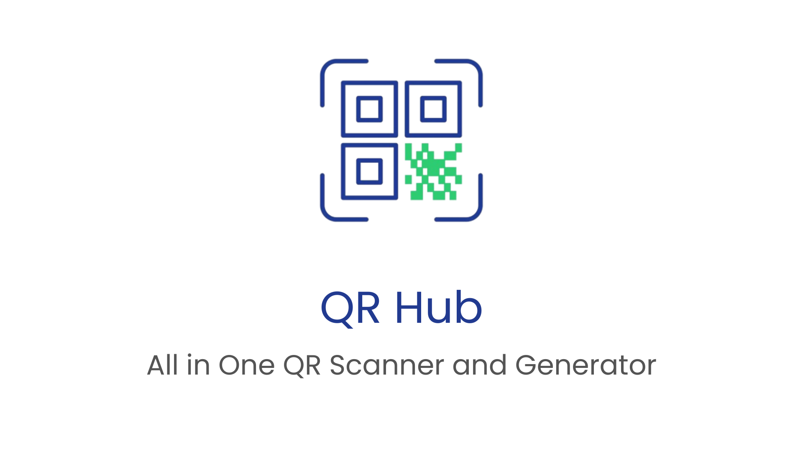
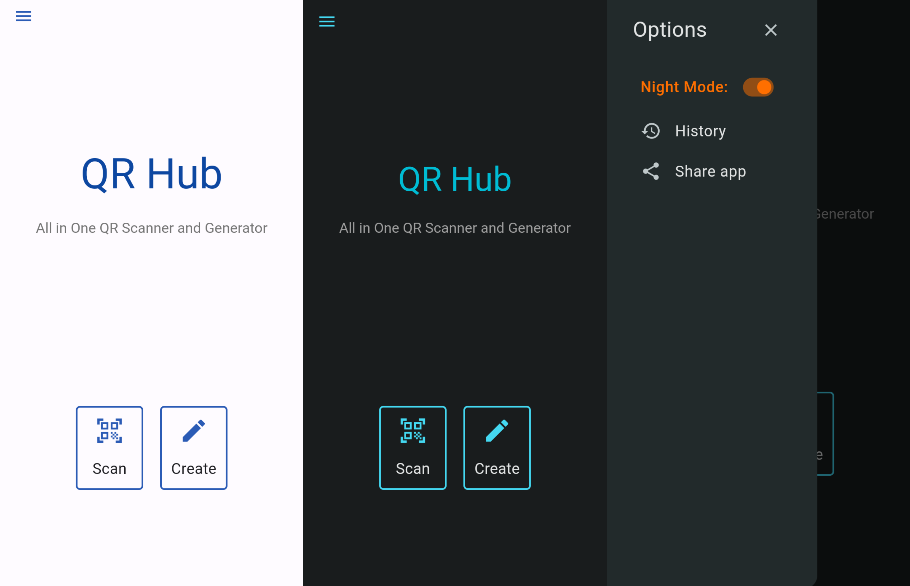
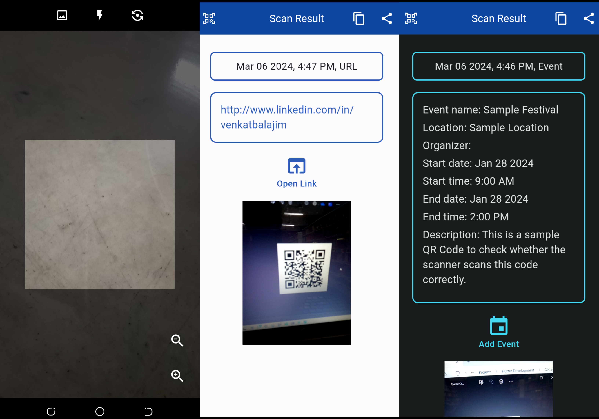
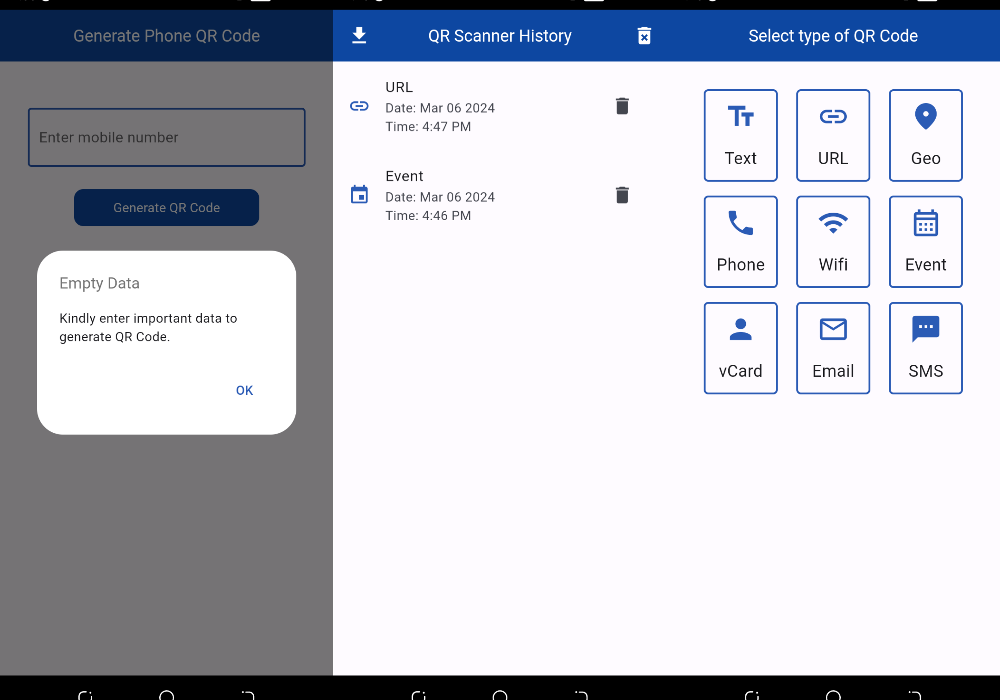

## Overview
QR Hub is a simple Android application to scan and generate QR codes, developed using Flutter. The app features a user-friendly interface for easy navigation and efficient usage.

## Features
- Simple and easy-to-use user interface. 
- Scans QR codes either using camera or scan images from device storage. 
- Generates QR codes for different kinds of data. 
- Download and share the generated QR codes easily. 
- Stores the scanned QR codes history for future reference. 
- Available in light and dark theme modes. 

## Screenshots

## Contributing
I welcome contributions from the community! If you'd like to contribute, please follow these guidelines:
- Fork the repository.
- Create a new branch for your feature or bug fix.
- Submit a pull request.

## Installation
1. Click the latest release in the repository. 
2. Check out the assets of the latest version of releases. 
3. Click the APK file in the assets to download and install QR Hub.

 

**NOTE:** Feel free to explore and enhance QR Hub with your valuable contributions!
If you have any queries, feel free to reach out to me at venkatbalajim123@gmail.com 

